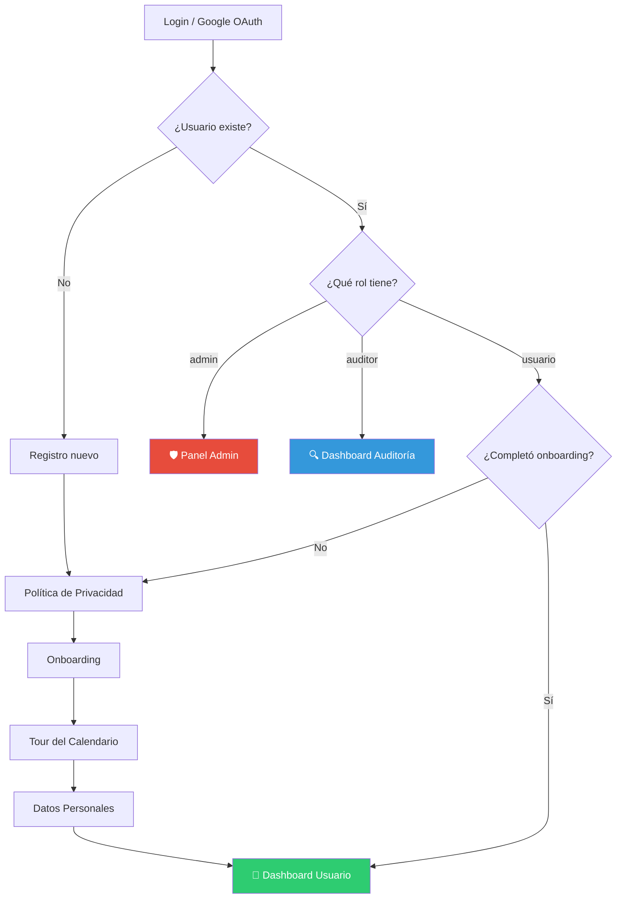

<p align="center">
  
</p>

<h1 align="center">🌰 Bellota</h1>

<p align="center">
  <strong>Plataforma integral de seguimiento del ciclo menstrual, registro clínico de síntomas y educación en salud femenina.</strong>
</p>

<p align="center">
  
  
  
  
  
</p>

---

## 📋 Índice

| Sección | Descripción |
|---------|-------------|
| [Descripción General](#-descripción-general) | Qué es Bellota y a quién va dirigida |
| [Características](#-características-principales) | Funcionalidades clave de la app |
| [Arquitectura](#-arquitectura) | Diseño técnico y capas del sistema |
| [Sistema de Roles (RBAC)](#-sistema-de-roles-rbac) | Administrador, Usuario y Auditor |
| [Esquema de Base de Datos](#-esquema-de-base-de-datos) | Diagrama ER y estructura de tablas |
| [Estructura del Proyecto](#-estructura-del-proyecto) | Organización de archivos y módulos |
| [Lógica de Fases del Ciclo](#-lógica-de-fases-del-ciclo) | Algoritmo de predicción |
| [Internacionalización](#-internacionalización) | Soporte multilingüe |
| [Requisitos Previos](#-requisitos-previos) | Herramientas necesarias para desarrollo |
| [Instalación para Desarrollo](#-instalación-para-desarrollo) | Clonar, configurar y ejecutar |
| [Instalar la APK en un Dispositivo](#-instalar-la-apk-en-un-dispositivo) | Pasos para instalar la app ya compilada |
| [Compilar APK desde Código Fuente](#-compilar-apk-desde-código-fuente) | Generar tu propio instalador |
| [Dependencias](#-dependencias) | Paquetes de terceros utilizados |

---

## 📖 Descripción General

**Bellota** es una aplicación móvil de salud femenina que empodera a mujeres en el entendimiento y monitoreo de su ciclo menstrual. Diseñada bajo el principio **Privacy by Design**, toda la información se almacena exclusivamente en el dispositivo del usuario mediante SQLite, eliminando la dependencia de servidores externos y garantizando privacidad absoluta.

### 🎯 Público Objetivo

| Segmento | Uso Principal |
|----------|---------------|
| 👩 Mujeres en edad reproductiva | Seguimiento personal del ciclo, síntomas y fertilidad |
| 🩺 Profesionales de salud | Reportes clínicos PDF estandarizados de pacientes |
| 🏥 Organizaciones de salud pública | Herramienta de educación menstrual comunitaria |
| 🌎 Comunidades multilingües (Miskitu) | Acceso en lengua indígena de Nicaragua |

---

## ✨ Características Principales

### 📅 Calendario Menstrual Inteligente
- Vistas **semanal** y **mensual** con predicción automática de fases
- Indicadores visuales por fase: 🔴 Menstrual · 🟡 Folicular · 🟠 Ovulatoria · 🟤 Lútea
- Tour interactivo guiado para nuevas usuarias

### 📝 Registro Diario Completo
```
┌─────────────────────────────────────────────────────┐
│  📊 Síntomas      → Físicos y emocionales          │
│  🩸 Sangrado      → Intensidad, coágulos, manchado │
│  😣 Dolor (EVA)   → Escala 0-10, carácter, días    │
│  💧 Flujo vaginal → Tipo y consistencia            │
│  🔒 Act. sexual   → Actividad y protección         │
│  🩺 Autoexamen    → Registro de mama               │
│  📋 Notas libres  → Observaciones personales       │
└─────────────────────────────────────────────────────┘
```

### 🗺️ Mapa de Centros de Salud
- Mapa interactivo con **OpenStreetMap** (`flutter_map`)
- Geolocalización de centros ginecológicos cercanos
- Ficha detallada con dirección, teléfono y horarios

### 📄 Reporte Médico PDF
- Generación automática de informe clínico profesional
- Historial de ciclos, síntomas frecuentes y alertas
- Exportable vía email, WhatsApp o cualquier app

### 🔔 Notificaciones Inteligentes
- Recordatorios de: período, ovulación, píldora, hidratación, ejercicio
- Horarios personalizables por tipo de recordatorio
- Citas médicas semanales programables
- Persistencia tras reinicio del dispositivo

### 🎨 Tema y Personalización
- Modo claro y oscuro con paleta "Bellota"
- Fuentes: Estrella, Poppins, Google Fonts
- `ThemeExtension` para consistencia visual global

---

## 🏗️ Arquitectura

```
┌─────────────────────────────────────────────────────────┐
│                  📱 CAPA DE PRESENTACIÓN                │
│  23 Screens · 5 Widgets · ThemeExtension · Google Fonts │
├─────────────────────────────────────────────────────────┤
│                  ⚙️ CAPA DE SERVICIOS                   │
│  AuthService    → Login, registro, sesión, Google OAuth │
│  CycleService   → Predicción de fases y fertilidad      │
│  NotifService   → Alarmas, recordatorios, boot receiver │
│  NavigationSvc  → Routing por rol y estado de onboarding│
│  LanguageNotif  → Cambio reactivo de idioma (ES/EN/MI)  │
│  ThemeNotifier   → Toggle de tema claro/oscuro           │
├─────────────────────────────────────────────────────────┤
│                  💾 CAPA DE DATOS                       │
│  DatabaseHelper → SQLite (sqflite) · 6 tablas           │
│  SharedPrefs    → Sesión, flags de onboarding, config   │
│  Migraciones    → v1 → v2 → v3 → v4 (incremental)     │
├─────────────────────────────────────────────────────────┤
│                  📦 CAPA DE MODELOS                     │
│  UserModel · ProfileModel · DailyLogModel               │
│  AuditLogModel · HealthCenterModel · UserRole           │
│  PillTime · WeeklyAppointment · NotificationModels      │
└─────────────────────────────────────────────────────────┘
```

### Principios

| Principio | Implementación |
|-----------|----------------|
| **Offline-First** | SQLite local como única fuente de verdad |
| **Privacy by Design** | Sin telemetría, sin servidores, datos 100% locales |
| **Reactive UI** | `ValueNotifier` + `ValueListenableBuilder` para idioma y tema |
| **RBAC** | Motor de permisos con guard widgets |
| **Single Responsibility** | Un servicio por dominio, un modelo por entidad |

---

## 🔐 Sistema de Roles (RBAC)

La aplicación implementa un sistema de **Control de Acceso Basado en Roles** con tres niveles:

### 👤 Usuario (Rol por defecto)

> Se asigna automáticamente al registrarse o iniciar sesión con Google.

| Permiso | Descripción |
|---------|-------------|
| ✅ `view_own` | Ver sus propios datos |
| ✅ `edit_own` | Editar su perfil y registros |
| ✅ `delete_own` | Eliminar sus datos |
| ✅ `log_symptoms` | Registrar síntomas diarios |
| ✅ `export_reports` | Generar y exportar PDF médico |

**Pantalla principal:** Dashboard → Calendario, Mapa, Síntomas, Perfil

---

### 🛡️ Administrador

> Acceso completo al sistema. Gestiona usuarios, roles y configuración global.

| Permiso | Descripción |
|---------|-------------|
| ✅ Todo de Usuario | + Acceso a datos de todos |
| ✅ `manage_users` | Crear, editar, suspender o eliminar cuentas |
| ✅ `assign_roles` | Cambiar rol de cualquier usuario |
| ✅ `suspend_users` | Suspender/reactivar cuentas |
| ✅ `moderate_content` | Moderar contenido de usuarios |
| ✅ `configure_system` | Configuraciones globales |
| ✅ `manage_backups` | Respaldos de base de datos |
| ✅ `view_audit_logs` | Acceso a logs de auditoría |

**Pantalla principal:** Panel de Administración

#### ¿Cómo activar el modo Administrador?

1. Abra una herramienta de base de datos SQLite (por ejemplo, [DB Browser for SQLite](https://sqlitebrowser.org/))
2. Abra el archivo `bellota.db` del dispositivo (ubicado en los datos internos de la app)
3. Ejecute la siguiente consulta:
```sql
UPDATE users SET role = 'admin' WHERE email = 'correo_del_usuario@ejemplo.com';
```
4. Cierre sesión en la app y vuelva a iniciar sesión

> ⚠️ **Importante:** El primer administrador debe asignarse manualmente vía SQL. Una vez asignado, ese administrador puede promover a otros usuarios desde el Panel Admin dentro de la app.

---

### 🔍 Auditor

> Acceso de solo lectura a todo el sistema. Diseñado para compliance y revisión.

| Permiso | Descripción |
|---------|-------------|
| ✅ `view_own` | Ver datos propios |
| ✅ `view_all` | Ver datos de todos los usuarios |
| ✅ `export_reports` | Exportar reportes |
| ✅ `view_audit_logs` | Consultar historial de acciones |
| ✅ `generate_compliance_reports` | Reportes de cumplimiento |
| ✅ `detect_anomalies` | Detección de anomalías |
| ❌ Escritura | No puede editar ni eliminar datos |

**Pantalla principal:** Dashboard de Auditoría

#### ¿Cómo activar el modo Auditor?

Desde el **Panel de Administración** (si ya existe un admin):
1. Abra el Panel Admin → pestaña **Usuarios**
2. Busque el usuario deseado
3. Toque el menú de acciones → **Cambiar Rol** → seleccione **Auditor**

O manualmente por SQL:
```sql
UPDATE users SET role = 'auditor' WHERE email = 'correo_del_usuario@ejemplo.com';
```

---

### Flujo de Acceso por Rol



---

## 🗃️ Esquema de Base de Datos

**Motor:** SQLite vía `sqflite` · **Archivo:** `bellota.db` · **Versión:** 4
**Foreign Keys:** `PRAGMA foreign_keys = ON`

### Diagrama Entidad-Relación

```mermaid
erDiagram
    USERS ||--o| PROFILES : "1:1 CASCADE"
    USERS ||--o{ PILL_TIMES : "1:N CASCADE"
    USERS ||--o{ WEEKLY_APPOINTMENTS : "1:N CASCADE"
    USERS ||--o{ DAILY_LOGS : "1:N CASCADE"
    USERS ||--o{ AUDIT_LOGS : "1:N SET NULL"

    USERS {
        INTEGER id PK "AUTOINCREMENT"
        TEXT name "NOT NULL"
        TEXT email "NOT NULL UNIQUE"
        TEXT password_hash "NOT NULL (SHA-256)"
        TEXT role "DEFAULT 'usuario'"
        INTEGER is_active "DEFAULT 1"
        TEXT created_at "ISO 8601"
    }

    PROFILES {
        INTEGER user_id PK_FK "→ users(id)"
        TEXT username "Display name"
        TEXT gmail "Cuenta Google"
        INTEGER cycle_duration "DEFAULT 28"
        INTEGER period_duration "DEFAULT 5"
        TEXT profile_image_path "Ruta local"
        INTEGER notif_periodo "DEFAULT 1"
        INTEGER notif_ovulacion "DEFAULT 1"
        INTEGER notif_pildora "DEFAULT 0"
        INTEGER notif_hidratacion "DEFAULT 0"
        INTEGER notif_ejercicio "DEFAULT 0"
        INTEGER notif_app "DEFAULT 1"
        INTEGER notif_sonidos "DEFAULT 1"
        INTEGER notif_cita_medica "DEFAULT 0"
        INTEGER notif_daily_log "DEFAULT 1"
        INTEGER notif_log_hour "DEFAULT 21"
        INTEGER notif_log_minute "DEFAULT 0"
    }

    DAILY_LOGS {
        INTEGER id PK "AUTOINCREMENT"
        INTEGER user_id FK "→ users(id)"
        TEXT date "YYYY-MM-DD UNIQUE(user_id,date)"
        INTEGER period_start "DEFAULT 0"
        INTEGER period_end "DEFAULT 0"
        TEXT symptoms "JSON array"
        TEXT flujo "JSON array"
        TEXT sexo "JSON array"
        TEXT bleeding_intensity "Intensidad"
        TEXT clots "Coágulos"
        INTEGER spotting "DEFAULT 0"
        REAL pain_level "EVA 0-10"
        TEXT pain_character "Tipo dolor"
        TEXT treatment "Medicamento"
        TEXT physical_symptoms "JSON array"
        TEXT emotional_symptoms "JSON array"
        TEXT breast_exam "Autoexamen"
        TEXT notes "Notas libres"
        TEXT created_at "ISO 8601"
    }

    PILL_TIMES {
        INTEGER id PK "AUTOINCREMENT"
        INTEGER user_id FK "→ users(id)"
        INTEGER hour "0-23"
        INTEGER minute "0-59"
    }

    WEEKLY_APPOINTMENTS {
        INTEGER id PK "AUTOINCREMENT"
        INTEGER user_id FK "→ users(id)"
        INTEGER weekday "1=Lun 7=Dom"
        INTEGER hour "Hora"
        INTEGER minute "Minuto"
    }

    AUDIT_LOGS {
        INTEGER id PK "AUTOINCREMENT"
        INTEGER user_id FK "→ users(id) SET NULL"
        TEXT action "NOT NULL"
        TEXT target_type "user o daily_log"
        INTEGER target_id "ID recurso"
        TEXT details "JSON contexto"
        TEXT ip_address "Opcional"
        TEXT created_at "ISO 8601"
    }
```

### Índices de Rendimiento

| Índice | Tabla | Columnas | Propósito |
|--------|-------|----------|-----------|
| `idx_daily_logs_user_date` | `daily_logs` | `(user_id, date)` | Consultas rápidas de registros por fecha |
| `idx_audit_logs_created` | `audit_logs` | `(created_at, action)` | Filtrado eficiente de logs |

### Historial de Migraciones

| Versión | Cambios |
|---------|---------|
| **v1 → v2** | +14 columnas en `daily_logs` (bleeding, pain, symptoms detallados) |
| **v2 → v3** | +`role`, `is_active` en `users`; +tabla `audit_logs` |
| **v3 → v4** | +notificaciones en `profiles`; +tablas `pill_times`, `weekly_appointments` |

---

## 📁 Estructura del Proyecto

```
bellotadevolpment/
├── 📱 android/                         # Config nativa Android + signing
├── 🍎 ios/                             # Config nativa iOS
├── 📦 assets/
│   ├── fonts/                          # Estrella.ttf, Poppins-Medium.ttf
│   └── images/                         # 12 archivos (logos, slides, banners)
├── 🖥️ backend/                         # FastAPI experimental (opcional)
└── 📂 lib/
    ├── main.dart                       # Entry point
    ├── core/
    │   ├── constants/app_keys.dart     # Claves de SharedPreferences
    │   ├── models/                     # 7 modelos de datos
    │   └── services/                   # Auth, Cycle, Notification
    ├── database/
    │   └── database_helper.dart        # SQLite CRUD + migraciones (1244 líneas)
    ├── l10n/
    │   ├── app_translations.dart       # Diccionario ES/EN/MI
    │   └── language_notifier.dart      # ValueNotifier reactivo
    ├── navigation/
    │   └── navigation_service.dart     # Routing por rol + onboarding
    ├── screens/                        # 23 pantallas
    ├── theme/
    │   ├── bellota_colors.dart         # Paleta de colores
    │   ├── bellota_theme.dart          # ThemeData claro y oscuro
    │   └── theme_notifier.dart         # Toggle de tema
    └── widgets/                        # 5 widgets reutilizables
```

### Las 23 Pantallas

| # | Pantalla | Rol | Descripción |
|---|----------|-----|-------------|
| 1 | `splash_screen` | Todos | Carga inicial y routing por sesión |
| 2 | `login_screen` | — | Login email/contraseña + Google OAuth |
| 3 | `register_screen` | — | Registro de nueva cuenta |
| 4 | `privacy_policy_screen` | Nuevos | Aceptación de política de privacidad |
| 5 | `onboarding_screen` | Nuevos | Carrusel de bienvenida (3 slides) |
| 6 | `calendar_tour_screen` | Nuevos | Tour guiado del calendario |
| 7 | `personal_data_screen` | Nuevos | Configuración inicial del perfil |
| 8 | `dashboard_screen` | 👤 | Home con fase actual y accesos rápidos |
| 9 | `calendar_screen` | 👤 | Calendario menstrual interactivo |
| 10 | `symptom_log_screen` | 👤 | Hub central de registro diario |
| 11 | `symptoms_selection_screen` | 👤 | Selector de síntomas por categoría |
| 12 | `dolor_sintomatologia_screen` | 👤 | Registro de dolor (EVA 0-10) |
| 13 | `patron_sangrado_screen` | 👤 | Patrón e intensidad de sangrado |
| 14 | `flujo_vaginal_selection_screen` | 👤 | Tipo de flujo vaginal |
| 15 | `sexo_selection_screen` | 👤 | Actividad sexual y protección |
| 16 | `map_screen` | 👤 | Mapa de centros de salud |
| 17 | `health_center_detail_screen` | 👤 | Detalle de centro de salud |
| 18 | `location_picker_screen` | 👤 | Selector de ubicación en mapa |
| 19 | `profile_screen` | 👤 | Perfil, preferencias y config |
| 20 | `medical_report_preview_screen` | 👤 | Vista previa y export del PDF |
| 21 | `notifications_settings_screen` | 👤 | Configuración de notificaciones |
| 22 | `admin_panel_screen` | 🛡️ | Gestión de usuarios y roles |
| 23 | `audit_dashboard_screen` | 🔍 | Revisión de logs y compliance |

---

## 🔄 Lógica de Fases del Ciclo

### Fórmulas de Predicción

```
Próximo ciclo    →  T_next = T_last + D_cycle
Día relativo     →  D = (Hoy - T_last) mod D_cycle + 1
```

### Clasificación

| Fase | Condición | Color | Ícono | Descripción |
|------|-----------|-------|-------|-------------|
| Menstrual | `D ≤ 5` | 🔴 Chilero | 🩸 | Período activo |
| Folicular | `5 < D ≤ 13` | 🟡 Maíz | 🌱 | Preparación del óvulo |
| Ovulatoria | `13 < D ≤ 16` | 🟠 Melón | 🥚 | Ventana fértil |
| Lútea | `D > 16` | 🟤 Bellota | 🌙 | Post-ovulación |

> **Variables:** `T_last` = último inicio de período · `D_cycle` = duración del ciclo (default 28 días) · `D` = día actual en el ciclo

---

## 🌐 Internacionalización

| Código | Idioma | Estado | Cobertura |
|--------|--------|--------|-----------|
| `es` | 🇳🇮 Español | ✅ Completo | Predeterminado |
| `mi` | 🏳️ Miskitu | ✅ Completo | Lengua indígena |
| `en` | 🇺🇸 Inglés | ✅ Completo | — |

Sistema reactivo: al cambiar el idioma, **todas** las pantallas se actualizan instantáneamente sin reiniciar la app (patrón `ValueListenableBuilder`).

---

## 📋 Requisitos Previos

### Para Desarrollo

| Herramienta | Versión | Comando de verificación |
|-------------|---------|------------------------|
| Flutter SDK | ≥ 3.13.0 | `flutter --version` |
| Dart SDK | ≥ 3.0.0 | `dart --version` |
| Android Studio | ≥ 2023.1 | Con Android SDK 34 |
| Java JDK | 17 | `java --version` |
| Git | ≥ 2.x | `git --version` |

### Para Instalar la APK

| Requisito | Detalle |
|-----------|---------|
| Android | Versión 5.0 (Lollipop) o superior — API 21+ |
| Espacio | ~80 MB de almacenamiento disponible |
| Permisos | Ubicación (para mapa), Cámara (para foto de perfil), Notificaciones |

---

## 📲 Instalar la APK en un Dispositivo

### Método 1: Por cable USB

1. Conecte su teléfono Android al computador con un cable USB
2. Habilite la **transferencia de archivos** en el teléfono
3. Copie el archivo `app-release.apk` a la carpeta **Descargas** del teléfono
4. En el teléfono, abra el archivo con un explorador de archivos
5. Si aparece un aviso de seguridad:
   - Vaya a **Configuración** → **Seguridad** → **Orígenes desconocidos** → ✅ Activar
   - O en Android 8+: **Configuración** → **Apps** → **Instalar apps desconocidas** → permita el explorador de archivos
6. Toque **Instalar** y espere a que termine

### Método 2: Por WhatsApp / Telegram

1. Envíese el archivo `app-release.apk` a sí mismo por WhatsApp o Telegram
2. Abra la conversación en el teléfono
3. Descargue y abra el archivo
4. Permita la instalación desde orígenes desconocidos si se solicita
5. Toque **Instalar**

### Método 3: Instalación directa (dispositivo conectado)

```bash
flutter install --release
```

> ⚠️ **Nota:** La primera vez que abra la app, se le pedirán permisos de ubicación y notificaciones. Aceptar para habilitar el mapa y los recordatorios.

---

## 🚀 Instalación para Desarrollo

### 1. Clonar el repositorio

```bash
git clone https://github.com/Jossmart28/Bellota-App.git
cd Bellota-App
```

### 2. Instalar dependencias

```bash
flutter pub get
```

### 3. Verificar entorno

```bash
flutter doctor -v
```

### 4. Ejecutar

```bash
# Debug (con hot reload)
flutter run

# Release (rendimiento óptimo)
flutter run --release
```

### 5. Verificar calidad

```bash
flutter analyze
```

---

## 🔨 Compilar APK desde Código Fuente

### Generar Keystore (solo la primera vez)

```bash
keytool -genkey -v \
  -keystore bellota-release-key.jks \
  -keyalg RSA -keysize 2048 \
  -validity 10000 -alias bellota
```

### Configurar firma

Crear `android/key.properties`:
```properties
storePassword=TU_CONTRASEÑA
keyPassword=TU_CONTRASEÑA
keyAlias=bellota
storeFile=../../bellota-release-key.jks
```

### Compilar

```bash
# APK universal
flutter build apk --release

# APKs por arquitectura (recomendado, más livianos)
flutter build apk --release --split-per-abi

# App Bundle para Google Play Store
flutter build appbundle --release
```

### Ubicación del APK generado

```
build/app/outputs/flutter-apk/app-release.apk
```

> ⚠️ **Seguridad:** Nunca suba los archivos `key.properties`, `*.jks` ni `*.keystore` a Git.

---

## 📚 Dependencias

| Paquete | Versión | Propósito |
|---------|---------|-----------|
| `sqflite` | ^2.4.3 | Base de datos SQLite |
| `shared_preferences` | ^2.2.2 | Almacenamiento clave-valor |
| `google_fonts` | ^8.2.1 | Tipografías de Google |
| `flutter_map` | ^7.0.2 | Mapas OpenStreetMap |
| `latlong2` | ^0.9.1 | Coordenadas geográficas |
| `geocoding` | ^3.0.0 | Geocodificación |
| `google_sign_in` | 6.2.2 | Autenticación Google OAuth |
| `image_picker` | ^1.1.2 | Cámara y galería |
| `pdf` | ^3.11.1 | Generación de PDF |
| `printing` | ^5.13.2 | Vista previa e impresión |
| `url_launcher` | ^6.3.2 | Abrir URLs externas |
| `share_plus` | ^10.1.4 | Compartir archivos |
| `flutter_local_notifications` | ^18.0.1 | Notificaciones locales |
| `timezone` | ^0.9.4 | Zonas horarias |
| `permission_handler` | ^11.3.1 | Gestión de permisos |
| `intl` | ^0.20.3 | Formateo i18n |
| `crypto` | ^3.0.3 | Hash SHA-256 |
| `uuid` | ^4.6.0 | Generación de IDs únicos |

---

## 🖥️ Backend (Opcional)

El directorio `backend/` contiene un servidor **FastAPI** experimental con SQLAlchemy y JWT. **La app funciona 100% sin él.** Está diseñado para futura sincronización multi-dispositivo.

---

## 📄 Licencia

Este proyecto es de uso privado. Todos los derechos reservados.

---

<p align="center">
  
  <br/>
  <sub>Hecho con ❤️ para la salud femenina · <strong>Bellota 2024 – 2026</strong></sub>
</p>
