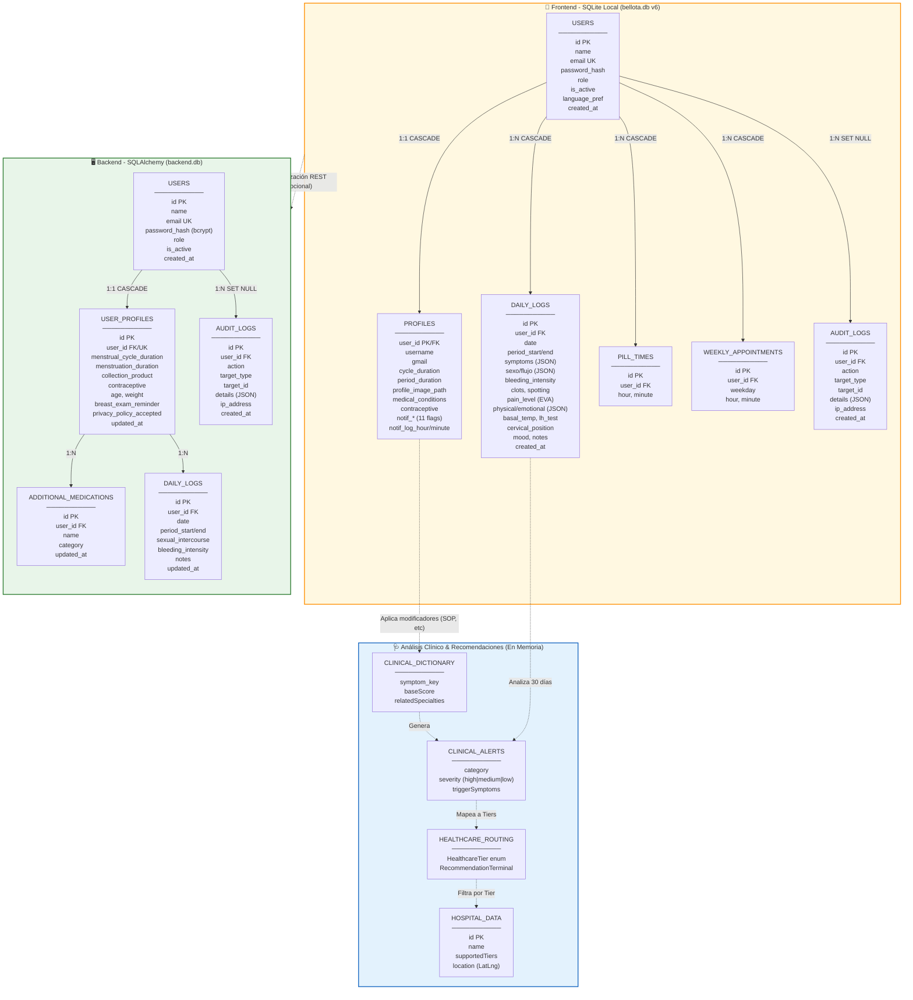
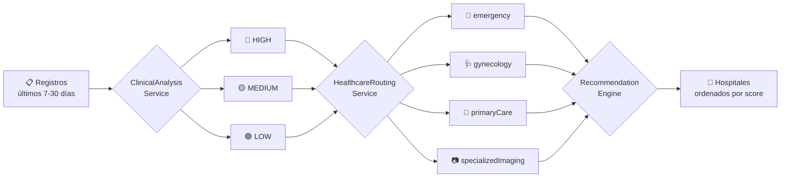

<h1 align="center">🌰 Bellota - Versión 1</h1>

---

## 📋 Índice

| # | Sección | Descripción |
|---|---------|-------------|
| 1 | [Descripción General](#-descripción-general) | Qué es Bellota, visión y público objetivo |
| 2 | [Características Principales](#-características-principales) | Funcionalidades clave de la plataforma |
| 3 | [Arquitectura del Sistema](#-arquitectura-del-sistema) | Diseño técnico full-stack y capas |
| 4 | [Sistema de Roles (RBAC)](#-sistema-de-roles-rbac) | Administrador, Usuario y Auditor |
| 5 | [Esquema de Base de Datos — Frontend (SQLite)](#-esquema-de-base-de-datos--frontend-sqlite) | Diagrama ER y estructura de tablas del móvil |
| 6 | [Esquema de Base de Datos — Backend (SQLAlchemy)](#-esquema-de-base-de-datos--backend-sqlalchemy) | Diagrama ER y estructura de tablas del servidor |
| 7 | [Diagrama Relacional Completo (Mermaid)](#-diagrama-relacional-completo) | DER unificado del sistema completo |
| 8 | [API REST — Referencia de Endpoints](#-api-rest--referencia-de-endpoints) | Documentación de la API FastAPI |
| 9 | [Estructura del Proyecto](#-estructura-del-proyecto) | Organización de archivos y módulos |
| 10 | [Lógica de Fases del Ciclo](#-lógica-de-fases-del-ciclo) | Algoritmo de predicción |
| 11 | [Motor de Alertas Clínicas](#-motor-de-alertas-clínicas) | Sistema de análisis y semáforo de riesgo |
| 12 | [Internacionalización (i18n)](#-internacionalización-i18n) | Soporte multilingüe |
| 13 | [Requisitos Previos](#-requisitos-previos) | Herramientas necesarias para desarrollo |
| 14 | [Instalación y Desarrollo](#-instalación-y-desarrollo) | Clonar, configurar y ejecutar |
| 15 | [Despliegue del Backend](#-despliegue-del-backend) | Docker, producción y variables de entorno |
| 16 | [Compilar e Instalar la APK](#-compilar-e-instalar-la-apk) | Generar el instalador Android |
| 17 | [Dependencias](#-dependencias) | Paquetes de terceros utilizados |
| 18 | [Migraciones de Base de Datos](#-migraciones-de-base-de-datos) | Historial de versiones del esquema |
| 19 | [Licencia](#-licencia) | Información legal |

---

## 📖 Descripción General

**Bellota** es una plataforma de salud femenina compuesta por una **aplicación móvil Flutter** y una **API REST con FastAPI**. Su objetivo es empoderar a mujeres en el monitoreo de su ciclo menstrual, registro clínico de síntomas y acceso a educación en salud reproductiva.

### Principios de Diseño

| Principio | Implementación |
|-----------|----------------|
| 🔒 **Privacy by Design** | Datos locales en SQLite cifrados en el dispositivo; sincronización opcional al backend |
| 📴 **Offline-First** | Toda la funcionalidad core opera sin conexión a internet |
| ♿ **Accesibilidad** | Soporte multilingüe incluyendo lengua indígena Miskitu |
| 🏥 **Rigor Clínico** | Motor de alertas basado en patrones semanales de síntomas con diccionario médico |

### 🎯 Público Objetivo

| Segmento | Uso Principal |
|----------|---------------|
| 👩 Mujeres en edad reproductiva | Seguimiento personal del ciclo, síntomas y fertilidad |
| 🩺 Profesionales de salud | Reportes clínicos PDF estandarizados de pacientes |
| 🏥 Organizaciones de salud pública | Herramienta de educación menstrual comunitaria |
| 🌎 Comunidades multilingües (Miskitu) | Acceso en lengua indígena de Nicaragua |

---

## ✨ Características Principales

### 📅 Calendario Menstrual Inteligente
- Vistas **semanal** y **mensual** con predicción automática de fases.
- Indicadores visuales dinámicos por fase: 🔴 Menstrual · 🟡 Folicular · 🟠 Ovulatoria · 🟤 Lútea.
- Mascota animada **"Bella"** que reacciona a los síntomas y fases del ciclo.

### 📝 Registro Clínico Diario y Predicción Inteligente
- **Predicción Multi-Día:** Motor de inteligencia que predice síntomas para los próximos días cruzando el historial de la fase actual, las tendencias de la última semana y bonificaciones por condiciones médicas previas (ej. SOP, Endometriosis).
- **Síntomas detallados:** Físicos, emocionales, digestivos y dermatológicos.
- **Sangrado y dolor:** Intensidad de flujo, coágulos, manchado (spotting) y escala EVA 0–10.
- **Flujo vaginal:** Clasificación médica por consistencia y color.
- **Vida sexual:** Registro de actividad y uso de métodos anticonceptivos.
- **Fertilidad avanzada:** Temperatura basal, test LH, posición cervical.
- **Humor y notas:** Control de variaciones del estado de ánimo con notas libres.

### 🗺️ Mapa de Centros de Salud & Motor de Recomendación
- Mapa interactivo con **OpenStreetMap** (flutter_map + Leaflet).
- **Motor de Recomendación por Tiers:** Sistema escalable basado en `HealthcareTier` (primaryCare, emergency, gynecology, specializedImaging) que filtra hospitales según el nivel de atención requerido por las alertas clínicas.
- **Cadena de routing:** `ClinicalAlert → HealthcareRoutingService.routeAlerts() → RecommendationTerminal[] → RecommendationEngine.recommend() → HospitalRecommendation[]`
- **Scoring 3-ejes:** Proximidad (40%) + Cobertura de Tiers (40%) + Relevancia base (20%).
- Base de datos de hospitales de la Costa Caribe de Nicaragua con geolocalización, servicios y `supportedTiers`.

### 🔔 Análisis Clínico y Alertas Inteligentes
- **Semáforo de alertas (High/Medium/Low):** Detecta patrones peligrosos basados en la repetición semanal de síntomas.
- **Routing Hospitalario Escalable:** Cada alerta se traduce en un `HealthcareTier` según severidad y categoría, adaptado al sistema MINSA rural.
- Considera condiciones médicas previas (SOP, Endometriosis, Hipotiroidismo) y efectos secundarios de anticonceptivos.
- Diccionario clínico integrado con ~80+ entradas en categorías: oncología, infecciones, dolor, sangrado, flujo, sexual, mama, fertilidad.
- **Indicador visual en Análisis:** FAB pulsante condicional (≥7 días de registro + alertas activas) que navega al Hospital Hub con terminales animadas.

### 📄 Reporte Médico PDF & Respaldo
- Generación de informe clínico profesional en **PDF** con membrete.
- Exportación e importación local de la base de datos completa (`.json`) para migraciones seguras.
- **Seguridad biométrica local:** Bloqueo opcional por huella digital o FaceID.

### 🔐 Backend REST con RBAC
- API **FastAPI** con autenticación **JWT** y autorización por roles.
- Documentación automática Swagger UI en `/docs`.
- Panel de administración de usuarios y dashboard de auditoría.
- Containerización con **Docker** lista para producción.

### 🔔 Notificaciones Inteligentes
- Recordatorios de período, ovulación y píldora anticonceptiva.
- Recordatorios de citas médicas semanales configurables.
- Recordatorio diario de registro con hora personalizable.

---

## 🏗️ Arquitectura del Sistema

```
┌─────────────────────────────────────────────────────────────────────────────┐
│                         📱 FRONTEND (Flutter/Dart)                         │
├─────────────────────────────────────────────────────────────────────────────┤
│                                                                             │
│  ┌─────────────────────────────────────────────────────────────────────┐    │
│  │               🖼️ CAPA DE PRESENTACIÓN (UI)                         │    │
│  │  32 Pantallas · 12 Widgets · ThemeExtension · Google Fonts           │    │
│  │  Flutter Animate · Staggered Animations · SVG Decorations          │    │
│  └────────────────────────────────┬────────────────────────────────────┘    │
│                                   │                                         │
│  ┌────────────────────────────────▼────────────────────────────────────┐    │
│  │               ⚙️ CAPA DE SERVICIOS (Business Logic)                │    │
│  │  ClinicalAnalysisService → Motor de alertas + HealthcareRoutingService     │    │
│  │  CycleService            → Predicción de fases y fertilidad        │    │
│  │  NotificationService     → Períodos, píldora, citas, recordatorios │    │
│  │  RecommendationEngine    → Matching por HealthcareTier ↔ hospitales          │    │
│  │  AuthService             → Login, biometría, sesión local          │    │
│  │  SyncService             → Exportación/Importación JSON            │    │
│  │  NavigationService       → Routing por rol y estado de onboarding  │    │
│  └────────────────────────────────┬────────────────────────────────────┘    │
│                                   │                                         │
│  ┌────────────────────────────────▼────────────────────────────────────┐    │
│  │               💾 CAPA DE DATOS (Local)                             │    │
│  │  DatabaseHelper → SQLite (sqflite) · 6 tablas · v6                 │    │
│  │  SharedPrefs    → Sesión, flags de onboarding, biometría           │    │
│  │  Migraciones    → v1 → v2 → v3 → v4 → v5 → v6 (incremental)      │    │
│  └────────────────────────────────┬────────────────────────────────────┘    │
│                                   │                                         │
│  ┌────────────────────────────────▼────────────────────────────────────┐    │
│  │               📦 CAPA DE MODELOS                                   │    │
│  │  UserModel · ProfileModel · DailyLogModel · AuditLogModel          │    │
│  │  HealthCenterModel · HospitalRecommendation · NotificationModels   │    │
│  │  UserRole (Enum: admin, usuario, auditor)                          │    │
│  └─────────────────────────────────────────────────────────────────────┘    │
│                                                                             │
├─────────────────────────────────────────────────────────────────────────────┤
│                    🌐 CAPA DE INTERNACIONALIZACIÓN (l10n)                   │
│  Español (es) · Inglés (en) · Miskitu (mi) · Delegate customizado         │
└──────────────────────────────────┬──────────────────────────────────────────┘
                                   │ HTTP/REST (opcional)
                                   ▼
┌─────────────────────────────────────────────────────────────────────────────┐
│                         🖥️ BACKEND (FastAPI/Python)                        │
├─────────────────────────────────────────────────────────────────────────────┤
│                                                                             │
│  ┌─────────────────────────────────────────────────────────────────────┐    │
│  │               🔌 CAPA DE API (Routers)                             │    │
│  │  /auth    → Registro, Login JWT, Seed Admin, /me                   │    │
│  │  /admin   → CRUD usuarios, roles, suspensión (solo admin)         │    │
│  │  /audit   → Logs de auditoría, estadísticas (admin + auditor)     │    │
│  │  /profile → Leer/Actualizar perfil de salud                       │    │
│  │  /logs    → Registros diarios del ciclo                           │    │
│  │  /medications → Medicamentos adicionales                          │    │
│  └────────────────────────────────┬────────────────────────────────────┘    │
│                                   │                                         │
│  ┌────────────────────────────────▼────────────────────────────────────┐    │
│  │               🔐 CAPA DE SEGURIDAD                                 │    │
│  │  JWT (HS256) · OAuth2 Bearer · bcrypt · RBAC con require_role()    │    │
│  │  CORS Middleware · Ownership checks (check_ownership_or_admin)     │    │
│  └────────────────────────────────┬────────────────────────────────────┘    │
│                                   │                                         │
│  ┌────────────────────────────────▼────────────────────────────────────┐    │
│  │               🗄️ CAPA DE PERSISTENCIA                              │    │
│  │  SQLAlchemy ORM · SQLite (backend.db) · Pydantic Schemas           │    │
│  │  5 modelos: User, AuditLog, UserProfile, AdditionalMedication,     │    │
│  │             DailyLog                                               │    │
│  └─────────────────────────────────────────────────────────────────────┘    │
│                                                                             │
│  🐳 Docker: python:3.11-slim · Uvicorn (port 8000) · Auto-reload          │
└─────────────────────────────────────────────────────────────────────────────┘
```

---

## 🔐 Sistema de Roles (RBAC)

La plataforma implementa **Control de Acceso Basado en Roles** tanto en el frontend (SQLite local) como en el backend (JWT + dependencias FastAPI):

| Rol | Permisos | Acceso UI | Protección Backend |
|-----|----------|-----------|-------------------|
| **👤 Usuario** | `view_own`, `edit_own`, `export_reports` | Dashboard → Calendario, Mapa, Registro | `get_current_active_user` |
| **🛡️ Administrador** | `manage_users`, `assign_roles`, `configure_system`, `view_all` | Panel de Administración + Todo lo del usuario | `require_role("admin")` |
| **🔍 Auditor** | `view_all`, `generate_compliance_reports` | Dashboard de Auditoría (solo lectura) | `require_role("admin", "auditor")` |

### Flujo de Bootstrapping del Primer Admin

1. **Frontend:** Se crea automáticamente un usuario admin seed al inicializar la BD (`_seedAdminUser`).
2. **Backend:** Endpoint `POST /auth/seed-admin` — solo funciona si no existe ningún admin en el sistema.

---

## 🗃️ Esquema de Base de Datos — Frontend (SQLite)

**Motor:** SQLite vía `sqflite` · **Archivo:** `bellota.db` · **Versión actual:** 6

```mermaid
erDiagram
    USERS ||--|| PROFILES : "1:1 CASCADE"
    USERS ||--o{ DAILY_LOGS : "1:N CASCADE"
    USERS ||--o{ PILL_TIMES : "1:N CASCADE"
    USERS ||--o{ WEEKLY_APPOINTMENTS : "1:N CASCADE"
    USERS ||--o{ AUDIT_LOGS : "1:N SET NULL"

    USERS {
        INTEGER id PK "AUTOINCREMENT"
        TEXT name "NOT NULL"
        TEXT email "NOT NULL UNIQUE"
        TEXT password_hash "NOT NULL (salted SHA-256)"
        TEXT role "DEFAULT 'usuario' (admin|usuario|auditor)"
        INTEGER is_active "DEFAULT 1"
        TEXT language_pref "DEFAULT 'es' (es|en|mi)"
        TEXT created_at "ISO 8601"
    end

    PROFILES {
        INTEGER user_id PK_FK "→ users(id) CASCADE"
        TEXT username "Nombre para mostrar"
        TEXT gmail "Cuenta Google (Opcional)"
        INTEGER cycle_duration "DEFAULT 28"
        INTEGER period_duration "DEFAULT 5"
        TEXT profile_image_path "Ruta local de imagen"
        TEXT medical_conditions "JSON array (SOP, Endometriosis, etc)"
        TEXT contraceptive "Método anticonceptivo activo"
        INTEGER notif_periodo "DEFAULT 1"
        INTEGER notif_ovulacion "DEFAULT 1"
        INTEGER notif_pildora "DEFAULT 0"
        INTEGER notif_hidratacion "DEFAULT 0"
        INTEGER notif_ejercicio "DEFAULT 0"
        INTEGER notif_app "DEFAULT 1"
        INTEGER notif_sonidos "DEFAULT 1"
        INTEGER notif_cita_medica "DEFAULT 0"
        INTEGER notif_daily_log "DEFAULT 1"
        INTEGER notif_log_hour "DEFAULT 21"
        INTEGER notif_log_minute "DEFAULT 0"
    end

    DAILY_LOGS {
        INTEGER id PK "AUTOINCREMENT"
        INTEGER user_id FK "→ users(id) CASCADE"
        TEXT date "YYYY-MM-DD UNIQUE(user_id, date)"
        INTEGER period_start "Boolean 1|0"
        INTEGER period_end "Boolean 1|0"
        TEXT symptoms "JSON array"
        TEXT sexo "JSON array"
        TEXT flujo "JSON array"
        TEXT bleeding_intensity "light|medium|heavy"
        TEXT clots "Descripción coágulos"
        INTEGER spotting "Boolean 1|0"
        TEXT spotting_days "Días de manchado"
        TEXT sexual_symptoms "Síntomas sexuales"
        REAL pain_level "EVA 0.0-10.0"
        TEXT pain_character "Tipo de dolor"
        TEXT pain_days "Días de dolor"
        TEXT treatment "Tratamiento aplicado"
        TEXT physical_symptoms "JSON array"
        TEXT emotional_symptoms "JSON array"
        TEXT breast_exam "Resultado autoexamen"
        TEXT notes "Notas libres"
        REAL basal_temp "Temperatura basal"
        TEXT lh_test_result "Resultado test LH"
        TEXT cervical_position "Posición cervical"
        TEXT mood "Estado de ánimo"
        TEXT created_at "ISO 8601"
    end

    PILL_TIMES {
        INTEGER id PK "AUTOINCREMENT"
        INTEGER user_id FK "→ users(id) CASCADE"
        INTEGER hour "0-23"
        INTEGER minute "0-59"
    end

    WEEKLY_APPOINTMENTS {
        INTEGER id PK "AUTOINCREMENT"
        INTEGER user_id FK "→ users(id) CASCADE"
        INTEGER weekday "1=Lun 7=Dom"
        INTEGER hour "Hora de la cita"
        INTEGER minute "Minuto de la cita"
    end

    AUDIT_LOGS {
        INTEGER id PK "AUTOINCREMENT"
        INTEGER user_id FK "→ users(id) SET NULL"
        TEXT action "NOT NULL (login, role_change, etc)"
        TEXT target_type "user|daily_log|profile"
        INTEGER target_id "ID del recurso afectado"
        TEXT details "JSON con contexto adicional"
        TEXT ip_address "Dirección IP (opcional)"
        TEXT created_at "ISO 8601"
    end
```

---

## 🗄️ Esquema de Base de Datos — Backend (SQLAlchemy)

**Motor:** SQLite vía SQLAlchemy ORM · **Archivo:** `backend.db` · **API Version:** 2.0.0

```mermaid
erDiagram
    BACKEND_USERS ||--|| BACKEND_USER_PROFILES : "1:1 CASCADE"
    BACKEND_USERS ||--o{ BACKEND_AUDIT_LOGS : "1:N SET NULL"
    BACKEND_USER_PROFILES ||--o{ BACKEND_ADDITIONAL_MEDICATIONS : "1:N"
    BACKEND_USER_PROFILES ||--o{ BACKEND_DAILY_LOGS : "1:N"

    BACKEND_USERS {
        int id PK "auto"
        string name "NOT NULL"
        string email "UNIQUE, INDEX"
        string password_hash "bcrypt"
        string role "admin|usuario|auditor"
        bool is_active "DEFAULT true"
        datetime created_at "auto now()"
    end

    BACKEND_USER_PROFILES {
        int id PK "auto"
        int user_id FK_UK "→ users(id) CASCADE"
        int menstrual_cycle_duration "DEFAULT 28"
        int menstruation_duration "DEFAULT 5"
        string collection_product "DEFAULT toalla_femenina"
        string contraceptive "nullable"
        int age "nullable"
        float weight "nullable"
        string weight_unit "DEFAULT kg"
        bool breast_exam_reminder "DEFAULT false"
        bool privacy_policy_accepted "DEFAULT false"
        datetime updated_at "auto now()"
    end

    BACKEND_AUDIT_LOGS {
        int id PK "auto"
        int user_id FK "→ users(id) SET NULL"
        string action "NOT NULL, INDEX"
        string target_type "nullable"
        int target_id "nullable"
        text details "JSON string"
        string ip_address "nullable"
        datetime created_at "auto now()"
    end

    BACKEND_ADDITIONAL_MEDICATIONS {
        int id PK "auto"
        int user_id FK "→ user_profiles(id)"
        string name "INDEX"
        string category "INDEX"
        datetime updated_at "auto now()"
    end

    BACKEND_DAILY_LOGS {
        int id PK "auto"
        int user_id FK "→ user_profiles(id)"
        string date "INDEX, YYYY-MM-DD"
        bool period_start "DEFAULT false"
        bool period_end "DEFAULT false"
        bool sexual_intercourse "DEFAULT false"
        string bleeding_intensity "nullable"
        string notes "nullable"
        datetime updated_at "auto now()"
    end
```

---

## 🔗 Diagrama Relacional Completo

Diagrama unificado que muestra las relaciones entre todas las entidades del sistema (Frontend + Backend):


```mermaid
graph TB
    subgraph FRONTEND["📱 Frontend - SQLite Local (bellota.db v6)"]
        direction TB
        FU["USERS<br/>───────────<br/>id PK<br/>name<br/>email UK<br/>password_hash<br/>role<br/>is_active<br/>language_pref<br/>created_at"]
        FP["PROFILES<br/>───────────<br/>user_id PK/FK<br/>username<br/>gmail<br/>cycle_duration<br/>period_duration<br/>profile_image_path<br/>medical_conditions<br/>contraceptive<br/>notif_* (11 flags)<br/>notif_log_hour/minute"]
        FDL["DAILY_LOGS<br/>───────────<br/>id PK<br/>user_id FK<br/>date<br/>period_start/end<br/>symptoms (JSON)<br/>sexo/flujo (JSON)<br/>bleeding_intensity<br/>clots, spotting<br/>pain_level (EVA)<br/>physical/emotional (JSON)<br/>basal_temp, lh_test<br/>cervical_position<br/>mood, notes<br/>created_at"]
        FPT["PILL_TIMES<br/>───────────<br/>id PK<br/>user_id FK<br/>hour, minute"]
        FWA["WEEKLY_APPOINTMENTS<br/>───────────<br/>id PK<br/>user_id FK<br/>weekday<br/>hour, minute"]
        FAL["AUDIT_LOGS<br/>───────────<br/>id PK<br/>user_id FK<br/>action<br/>target_type<br/>target_id<br/>details (JSON)<br/>ip_address<br/>created_at"]

        FU -- "1:1 CASCADE" --> FP
        FU -- "1:N CASCADE" --> FDL
        FU -- "1:N CASCADE" --> FPT
        FU -- "1:N CASCADE" --> FWA
        FU -- "1:N SET NULL" --> FAL
    end

    subgraph CLINICAL["🩺 Análisis Clínico & Recomendaciones (En Memoria)"]
        direction TB
        CD["CLINICAL_DICTIONARY<br/>───────────<br/>symptom_key<br/>baseScore<br/>relatedSpecialties"]
        CA["CLINICAL_ALERTS<br/>───────────<br/>category<br/>severity (high|medium|low)<br/>triggerSymptoms"]
        HR["HEALTHCARE_ROUTING<br/>───────────<br/>HealthcareTier enum<br/>RecommendationTerminal"]
        HC["HOSPITAL_DATA<br/>───────────<br/>id PK<br/>name<br/>supportedTiers<br/>location (LatLng)"]

        CD -. "Genera" .-> CA
        CA -. "Mapea a Tiers" .-> HR
        HR -. "Filtra por Tier" .-> HC
    end
    subgraph BACKEND["🖥️ Backend - SQLAlchemy (backend.db)"]
        direction TB
        BU["USERS<br/>───────────<br/>id PK<br/>name<br/>email UK<br/>password_hash (bcrypt)<br/>role<br/>is_active<br/>created_at"]
        BUP["USER_PROFILES<br/>───────────<br/>id PK<br/>user_id FK/UK<br/>menstrual_cycle_duration<br/>menstruation_duration<br/>collection_product<br/>contraceptive<br/>age, weight<br/>breast_exam_reminder<br/>privacy_policy_accepted<br/>updated_at"]
        BAL["AUDIT_LOGS<br/>───────────<br/>id PK<br/>user_id FK<br/>action<br/>target_type<br/>target_id<br/>details (JSON)<br/>ip_address<br/>created_at"]
        BAM["ADDITIONAL_MEDICATIONS<br/>───────────<br/>id PK<br/>user_id FK<br/>name<br/>category<br/>updated_at"]
        BDL["DAILY_LOGS<br/>───────────<br/>id PK<br/>user_id FK<br/>date<br/>period_start/end<br/>sexual_intercourse<br/>bleeding_intensity<br/>notes<br/>updated_at"]

        BU -- "1:1 CASCADE" --> BUP
        BU -- "1:N SET NULL" --> BAL
        BUP -- "1:N" --> BAM
        BUP -- "1:N" --> BDL
    end

    FRONTEND -. "Sincronización REST (Opcional)" .-> BACKEND
    FDL -. "Analiza 30 días" .-> CA
    FP -. "Aplica modificadores (SOP, etc)" .-> CD

    style FRONTEND fill:#FFF8E1,stroke:#FF8F00,stroke-width:2px
    style BACKEND fill:#E8F5E9,stroke:#2E7D32,stroke-width:2px
    style CLINICAL fill:#E3F2FD,stroke:#1565C0,stroke-width:2px
```

---

## 🔌 API REST — Referencia de Endpoints

**Base URL:** `http://localhost:8000` · **Docs:** `/docs` (Swagger UI) · **Autenticación:** JWT Bearer Token

### 🔑 Autenticación (`/auth`)

| Método | Endpoint | Descripción | Auth |
|--------|----------|-------------|------|
| `POST` | `/auth/register` | Registra un nuevo usuario | ❌ |
| `POST` | `/auth/login` | Inicia sesión, retorna JWT | ❌ |
| `GET` | `/auth/me` | Datos del usuario actual | ✅ Bearer |
| `POST` | `/auth/seed-admin` | Crea el primer admin (solo si no existe ninguno) | ❌ |

### 🛡️ Administración (`/admin`) — Solo Admin

| Método | Endpoint | Descripción |
|--------|----------|-------------|
| `GET` | `/admin/users` | Lista todos los usuarios (paginado) |
| `GET` | `/admin/users/{id}` | Detalles de un usuario |
| `PUT` | `/admin/users/{id}/role` | Cambia el rol de un usuario |
| `PUT` | `/admin/users/{id}/status` | Suspende o reactiva una cuenta |
| `DELETE` | `/admin/users/{id}` | Elimina permanentemente un usuario |

### 📊 Auditoría (`/audit`) — Admin + Auditor

| Método | Endpoint | Descripción |
|--------|----------|-------------|
| `GET` | `/audit/logs` | Consulta historial con filtros (usuario, acción, fechas) |
| `GET` | `/audit/stats` | Estadísticas generales (total, hoy, logins fallidos, etc.) |

### 👤 Perfiles (`/profile`) — Owner + Admin

| Método | Endpoint | Descripción |
|--------|----------|-------------|
| `GET` | `/profile/{user_id}` | Lee el perfil de salud |
| `PUT` | `/profile/{user_id}` | Actualiza el perfil de salud |

### 💊 Medicamentos (`/medications`) — Owner + Admin

| Método | Endpoint | Descripción |
|--------|----------|-------------|
| `GET` | `/medications/{user_id}` | Lista medicamentos del usuario |
| `POST` | `/medications/{user_id}` | Agrega un nuevo medicamento |
| `DELETE` | `/medications/{med_id}` | Elimina un medicamento |

### 📋 Registros Diarios (`/logs`) — Owner + Admin

| Método | Endpoint | Descripción |
|--------|----------|-------------|
| `GET` | `/logs/{user_id}/{date}` | Obtiene el registro de un día específico |
| `POST` | `/logs/{user_id}` | Crea o actualiza el registro diario |

---

## 📁 Estructura del Proyecto

```
bellotadevolpment/
├── 📱 android/                              # Configuración nativa Android + Signing
│   ├── app/build.gradle.kts                 # Compilación y versionamiento
│   └── key.properties                       # Keystore para release (no versionado)
│
├── 📦 assets/
│   ├── decorations/                         # SVG decorativos (dashboard, perfil)
│   ├── fonts/                               # Estrella.ttf, Poppins-Medium.ttf
│   └── images/                              # Mascotas Bella (4 fases), logos, banners
│
├── 📂 lib/                                  # ──── Código Fuente Flutter ────
│   ├── main.dart                            # Entry point + Global Error Boundary
│   │
│   ├── core/
│   │   ├── constants/                       # Claves de app y datos de Nicaragua
│   │   │   ├── app_keys.dart
│   │   │   └── nicaragua_data.dart
│   │   ├── data/                            # Datos clínicos y de hospitales
│   │   │   ├── clinical_dictionary.dart     # Diccionario de síntomas médicos
│   │   │   ├── hospital_data.dart           # Base de datos de hospitales

│   │   │   └── hospital_repository.dart     # Repositorio + filtrado por tiers
│   │   ├── models/                          # Modelos de datos
│   │   │   ├── audit_log_model.dart
│   │   │   ├── daily_log_model.dart
│   │   │   ├── health_center_model.dart
│   │   │   ├── hospital_recommendation.dart
│   │   │   ├── notification_models.dart
│   │   │   ├── profile_model.dart
│   │   │   ├── user_model.dart
│   │   │   └── user_role.dart               # Enum RBAC (admin|usuario|auditor)
│   │   └── services/                        # Lógica de negocio
│   │       ├── auth_service.dart            # Login, biometría, sesión local
│   │       ├── clinical_analysis_service.dart # Motor de alertas médicas
│   │       ├── cycle_service.dart           # Predicción de fases del ciclo
│   │       ├── notification_service.dart    # Notificaciones locales
│   │       ├── recommendation_engine.dart   # Matching hospitales ↔ síntomas
│   │       ├── sync_service.dart            # Export/Import JSON
│   │       └── user_health_profile.dart     # Perfil de salud consolidado
│   │
│   ├── database/
│   │   └── database_helper.dart             # SQLite CRUD + Migraciones (v1→v6)
│   │
│   ├── l10n/                                # Internacionalización
│   │   ├── app_localizations.dart           # Clase principal generada
│   │   ├── app_localizations_es.dart        # Español
│   │   ├── app_localizations_en.dart        # Inglés
│   │   ├── app_localizations_mi.dart        # Miskitu
│   │   ├── app_translations.dart            # Traducciones adicionales
│   │   ├── language_notifier.dart           # ValueNotifier de idioma
│   │   └── miskito_fallback_delegate.dart   # Delegate para Miskitu
│   │
│   ├── navigation/
│   │   └── navigation_service.dart          # Routing por rol + verificación biométrica
│   │
│   ├── screens/                             # ──── 32 Pantallas ────
│   │   ├── splash_screen.dart               # Pantalla de carga inicial
│   │   ├── onboarding_screen.dart           # Slides de bienvenida
│   │   ├── auth_screen.dart                 # Selector Login/Register
│   │   ├── login_screen.dart                # Inicio de sesión
│   │   ├── register_screen.dart             # Registro de cuenta
│   │   ├── language_selection_screen.dart    # Selección de idioma
│   │   ├── birth_year_screen.dart           # Año de nacimiento
│   │   ├── personal_data_screen.dart        # Datos personales
│   │   ├── privacy_policy_screen.dart       # Política de privacidad
│   │   ├── dashboard_screen.dart            # Panel principal + Bella mascota
│   │   ├── calendar_screen.dart             # Calendario menstrual
│   │   ├── calendar_tour_screen.dart        # Tour guiado del calendario
│   │   ├── symptom_log_screen.dart          # Registro principal de síntomas
│   │   ├── symptoms_selection_screen.dart   # Selección de síntomas
│   │   ├── patron_sangrado_screen.dart      # Patrón de sangrado
│   │   ├── dolor_sintomatologia_screen.dart # Dolor y sintomatología
│   │   ├── flujo_vaginal_selection_screen.dart # Flujo vaginal
│   │   ├── sexo_selection_screen.dart       # Vida sexual
│   │   ├── resumen_diario_screen.dart       # Resumen del día
│   │   ├── profile_screen.dart              # Perfil de usuario
│   │   ├── notifications_settings_screen.dart # Configuración notificaciones
│   │   ├── account_language_screen.dart     # Configuración de idioma
│   │   ├── medical_report_preview_screen.dart # Vista previa reporte PDF
│   │   ├── hospital_hub_screen.dart         # Hub de hospitales
│   │   ├── all_hospitals_screen.dart        # Lista completa de hospitales
│   │   ├── health_center_detail_screen.dart # Detalle de centro de salud
│   │   ├── map_screen.dart                  # Mapa interactivo
│   │   ├── location_picker_screen.dart      # Selector de ubicación
│   │   ├── admin_panel_screen.dart          # Panel de administración (Admin)
│   │   └── audit_dashboard_screen.dart      # Dashboard de auditoría (Auditor)
│   │
│   ├── theme/                               # Tematización
│   │   ├── bellota_colors.dart              # Paleta de colores (Bellota palette)
│   │   ├── bellota_theme.dart               # ThemeData light/dark
│   │   └── theme_notifier.dart              # ValueNotifier de tema
│   │
│   └── widgets/                             # Componentes reutilizables
│       ├── bellota_empty_state.dart          # Estado vacío con Bella
│       ├── bellota_icon.dart                # Ícono personalizado
│       ├── bellota_text_field.dart           # Campo de texto estilizado
│       ├── bellota_top_actions.dart          # Acciones superiores
│       ├── botanical_divider.dart           # Divisor decorativo
│       ├── cozy_row_item.dart               # Fila con estilo acogedor
│       ├── cycle_ring_widget.dart           # Anillo visual del ciclo
│       ├── health_info_carousel.dart        # Carrusel informativo
│       ├── match_badge.dart                 # Badge de coincidencia
│       ├── nearby_hospital_card.dart        # Tarjeta de hospital cercano
│       ├── recommended_hospital_card.dart   # Tarjeta de recomendación
│       ├── role_guard.dart                  # Guard de rol en UI
│       └── rpg_help_dialog.dart             # Diálogo de ayuda gamificado
│
├── 🖥️ backend/                              # ──── API REST (FastAPI) ────
│   ├── Dockerfile                           # Imagen Docker python:3.11-slim
│   ├── requirements.txt                     # Dependencias Python
│   └── app/
│       ├── main.py                          # FastAPI app + CORS + Routers
│       ├── __init__.py
│       ├── api/
│       │   └── routers/
│       │       ├── auth.py                  # /auth (register, login, seed-admin)
│       │       ├── admin.py                 # /admin (CRUD usuarios, roles)
│       │       ├── audit.py                 # /audit (logs, estadísticas)
│       │       ├── profile.py               # /profile (leer/actualizar)
│       │       ├── logs.py                  # /logs (registros diarios)
│       │       └── medications.py           # /medications (CRUD medicamentos)
│       ├── core/
│       │   ├── auth.py                      # JWT, bcrypt, require_role()
│       │   └── database.py                  # SQLAlchemy engine + SessionLocal
│       ├── crud/
│       │   └── crud.py                      # Operaciones CRUD completas
│       ├── models/
│       │   └── models.py                    # ORM: User, AuditLog, UserProfile, etc.
│       └── schemas/
│           └── schemas.py                   # Pydantic: validación de entrada/salida
│
└── 📄 Archivos raíz
    ├── pubspec.yaml                         # Dependencias Flutter + assets
    ├── README.md                            # Este archivo
    └── analysis_options.yaml                # Reglas de linting
```

---

## 🔄 Lógica de Fases del Ciclo

El `CycleService` calcula la fase actual basándose en el último inicio de período registrado y la duración configurada del ciclo:

| Fase | Condición (D = día del ciclo) | Color | Ícono | Mascota Bella | Descripción |
|------|-------------------------------|-------|-------|---------------|-------------|
| 🔴 Menstrual | D ≤ `period_duration` | Chilero | 🩸 | 😵 Mareada | Período activo |
| 🟡 Folicular | `period_duration` < D ≤ `cycle_duration - 15` | Maíz | 🌱 | 🤸 Estirando | Preparación del óvulo |
| 🟠 Ovulatoria | `cycle_duration - 15` < D ≤ `cycle_duration - 12` | Melón | 🥚 | 😴 Relajada | Ventana fértil |
| 🟤 Lútea | D > `cycle_duration - 12` | Bellota | 🌙 | 📦 Refugiada | Post-ovulación → SPM |

> **Variables:**
> - `T_last` = fecha del último `period_start = true`
> - `D_cycle` = duración del ciclo (configurable, default 28 días)
> - `D_period` = duración del período (configurable, default 5 días)
> - `D` = `(hoy - T_last).days + 1`

---

## 🚨 Motor de Alertas Clínicas

El `ClinicalAnalysisService` analiza los registros de los últimos 7 y 30 días para generar alertas con un sistema de semáforo, que luego se traducen en niveles de atención hospitalaria (`HealthcareTier`) mediante el `HealthcareRoutingService`:


```mermaid
flowchart LR
    A["📋 Registros<br/>últimos 7-30 días"] --> B{"ClinicalAnalysis<br/>Service"}
    B --> C["🔴 HIGH"]
    B --> D["🟡 MEDIUM"]
    B --> E["🟢 LOW"]
    C --> F{"HealthcareRouting<br/>Service"}
    D --> F
    E --> F
    F --> G["🏥 emergency"]
    F --> H["🩺 gynecology"]
    F --> I["🏪 primaryCare"]
    F --> J["📷 specializedImaging"]
    G --> K{"Recommendation<br/>Engine"}
    H --> K
    I --> K
    J --> K
    K --> L["📍 Hospitales<br/>ordenados por score"]
```

### Niveles de Atención (HealthcareTier)

| Tier | Descripción MINSA | Ejemplo |
|------|-------------------|---------|
| `primaryCare` | Puesto/Centro de Salud | Consulta general, ITS, planificación familiar |
| `emergency` | Emergencias 24/7 | Dolor severo, sangrado de emergencia |
| `gynecology` | Ginecología especializada | Sangrado anormal persistente, riesgo embarazo |
| `specializedImaging` | Imagenología (mamografía, ultrasonido) | Bulto en mama, seguimiento oncológico |

### Categorías de Alerta

| Categoría | Ejemplo de Trigger | Severidad | Tier Resultante |
|-----------|-------------------|-----------|-----------------|
| `oncology` | Bulto en mama, cambio de piel mamario | 🔴 HIGH | specializedImaging + gynecology |
| `breast` | Descarga mamaria, dolor localizado | 🔴 HIGH | specializedImaging + gynecology |
| `infection` | Flujo amarillo/verde + olor fétido | 🔴 HIGH | primaryCare |
| `pain` | Dolor EVA ≥ 7 por 3+ días/semana | 🟡 MEDIUM | emergency (si HIGH) / gynecology |
| `sexual_risk` | Relaciones sin protección + síntomas ITS | 🟡 MEDIUM | primaryCare |
| `bleeding` | Sangrado abundante persistente | 🟡 MEDIUM | gynecology |
| `menorrhagia` | Coágulos frecuentes + flujo abundante | 🟡 MEDIUM | gynecology |
| `flow_anomaly` | Flujo vaginal anormal recurrente | 🟡 MEDIUM | primaryCare |
| `contraception` | Uso frecuente píldora emergencia | 🟡 MEDIUM | gynecology |
| `emotional` | Patrones emocionales persistentes | 🟢 LOW | primaryCare |
| `spotting` | Manchado entre períodos | 🟢 LOW | primaryCare |
| `cycle` | Irregularidad del ciclo > 7 días | 🟢 LOW | primaryCare |

> **Nota:** Las alertas se modifican dinámicamente según las condiciones médicas previas (SOP, Endometriosis, Hipotiroidismo) y los métodos anticonceptivos configurados en el perfil. El `ClinicalDictionary.calculateDynamicScore()` ajusta las puntuaciones base según estas condiciones.

---

## 🌐 Internacionalización (i18n)

| Código | Idioma | Estado | Delegate | Cobertura |
|--------|--------|--------|----------|-----------|
| `es` | 🇳🇮 Español | ✅ Completo | `AppLocalizations` | Predeterminado |
| `en` | 🇺🇸 Inglés | ✅ Completo | `AppLocalizations` | — |
| `mi` | 🏳️ Miskitu | ✅ Completo | `MiskitoFallbackDelegate` | Lengua indígena de Nicaragua |

La aplicación utiliza el sistema `flutter_localizations` con un delegate personalizado para Miskitu (no soportado nativamente por Flutter). El idioma se persiste en `SharedPreferences` y en la columna `language_pref` de la tabla `users`.

---

## 📋 Requisitos Previos

### Para el Frontend (Flutter)

| Herramienta | Versión Mínima | Propósito |
|-------------|----------------|-----------|
| Flutter SDK | 3.13+ | Framework de desarrollo |
| Dart SDK | 3.0+ | Lenguaje de programación |
| Android Studio / VS Code | Última | IDE de desarrollo |
| Android SDK | API 21+ | Compilación Android |
| JDK | 17+ | Build Android nativo |

### Para el Backend (FastAPI)

| Herramienta | Versión Mínima | Propósito |
|-------------|----------------|-----------|
| Python | 3.11+ | Runtime del servidor |
| pip | Última | Gestor de paquetes |
| Docker *(opcional)* | 20+ | Containerización |

---

## 🚀 Instalación y Desarrollo

### 1. Clonar el Repositorio

```bash
git clone https://github.com/Jossmart28/Bellota-App.git
cd Bellota-App
```

### 2. Configurar el Frontend (Flutter)

```bash
# Instalar dependencias
flutter pub get

# Verificar entorno
flutter doctor

# Ejecutar en modo debug
flutter run
```

### 3. Configurar el Backend (FastAPI)

```bash
cd backend

# Crear entorno virtual
python -m venv venv

# Activar entorno virtual
# Windows:
venv\Scripts\activate
# Linux/Mac:
source venv/bin/activate

# Instalar dependencias
pip install -r requirements.txt

# Ejecutar el servidor de desarrollo
uvicorn app.main:app --reload --port 8000
```

El servidor estará disponible en `http://localhost:8000` y la documentación interactiva en `http://localhost:8000/docs`.

---

## 🐳 Despliegue del Backend

### Con Docker

```bash
cd backend

# Construir la imagen
docker build -t bellota-api .

# Ejecutar el contenedor
docker run -d -p 8000:8000 --name bellota-backend bellota-api
```

### Variables de Entorno (Producción)

> [!CAUTION]
> Antes de desplegar en producción, **cambie** la `SECRET_KEY` en `backend/app/core/auth.py` y configure las siguientes variables:

| Variable | Descripción | Default |
|----------|-------------|---------|
| `SECRET_KEY` | Clave secreta para firmar JWT | `bellota-secret-key-change-in-production-2024` |
| `ALGORITHM` | Algoritmo JWT | `HS256` |
| `ACCESS_TOKEN_EXPIRE_MINUTES` | Expiración del token | `60` |
| `SQLALCHEMY_DATABASE_URL` | URL de la base de datos | `sqlite:///./backend.db` |

---

## 📲 Compilar e Instalar la APK

### Compilar desde Código Fuente

```bash
# 1. Asegúrese de tener bellota-release-key.jks en la raíz del proyecto
# 2. Verificar key.properties en android/

# 3. Compilar APK release
flutter build apk --release

# 4. El archivo final estará en:
#    build/app/outputs/flutter-apk/app-release.apk
```

### Instalar en Dispositivo

1. Transfiera el archivo `app-release.apk` a su dispositivo Android.
2. En el dispositivo, vaya a **Configuración → Seguridad → Orígenes desconocidos** y habilítelo.
3. Abra el archivo APK desde el explorador de archivos y toque **Instalar**.

---

## 📚 Dependencias

### Frontend (Flutter/Dart)

| Paquete | Versión | Propósito |
|---------|---------|-----------|
| `sqflite` | ^2.4.3 | Base de datos SQLite local |
| `local_auth` | ^3.0.2 | Biometría (huella/FaceID) |
| `flutter_map` | ^7.0.2 | Mapas OpenStreetMap |
| `latlong2` | ^0.9.1 | Coordenadas geográficas |
| `geocoding` | ^3.0.0 | Geocodificación de direcciones |
| `google_sign_in` | 6.2.2 | Autenticación Google OAuth |
| `pdf` | ^3.11.1 | Generación de reportes PDF |
| `printing` | ^5.13.2 | Impresión de documentos |
| `flutter_local_notifications` | ^18.0.1 | Notificaciones y alarmas |
| `share_plus` | ^10.1.4 | Compartir archivos (backups) |
| `file_picker` | 8.1.4 | Selector de archivos (importar) |
| `image_picker` | ^1.1.2 | Foto de perfil |
| `google_fonts` | ^8.2.1 | Tipografías web |
| `flutter_svg` | ^2.3.0 | Renderizado SVG |
| `flutter_animate` | ^4.5.2 | Animaciones declarativas |
| `flutter_staggered_animations` | ^1.1.1 | Animaciones escalonadas |
| `badges` | ^4.0.1 | Badges de notificación |
| `crypto` | ^3.0.3 | SHA-256 local |
| `shared_preferences` | ^2.2.2 | Almacenamiento clave-valor |
| `uuid` | ^4.6.0 | Generación de IDs únicos |
| `intl` | ^0.20.3 | Formateo de fechas/números |
| `timezone` | ^0.9.4 | Zonas horarias |
| `permission_handler` | ^11.3.1 | Permisos del sistema |
| `url_launcher` | ^6.3.2 | Abrir URLs externas |
| `screenshot` | ^3.0.0 | Capturas de pantalla |
| `path_provider` | ^2.1.6 | Rutas del sistema de archivos |

### Backend (Python)

| Paquete | Propósito |
|---------|-----------|
| `fastapi` | Framework web async |
| `uvicorn[standard]` | Servidor ASGI |
| `sqlalchemy` | ORM para base de datos |
| `pydantic` | Validación de esquemas |
| `python-jose[cryptography]` | Generación/verificación JWT |
| `passlib[bcrypt]` | Hashing de contraseñas |
| `python-multipart` | Soporte para form-data |

---

## 🔄 Migraciones de Base de Datos

### Frontend — SQLite (bellota.db)

| Versión | Cambios |
|---------|---------|
| **v1** | Tablas `users`, `profiles`, `daily_logs` base |
| **v2** | Columnas de sangrado, dolor y síntomas emocionales/físicos en `daily_logs`; migración de `SharedPreferences` a SQLite |
| **v3** | Columnas `role` e `is_active` en `users`; tabla `audit_logs` |
| **v4** | Columnas de notificación avanzada en `profiles` (`notif_daily_log`, `notif_log_hour/minute`); tablas `pill_times` y `weekly_appointments` |
| **v5** | Columnas `medical_conditions` y `contraceptive` en `profiles`; columnas `basal_temp`, `lh_test_result`, `cervical_position`, `mood` en `daily_logs` |
| **v6** | Columna `language_pref` en `users` |

> [!NOTE]
> Las migraciones son incrementales y no destructivas. Cada `ALTER TABLE` se envuelve en un `try-catch` para evitar errores si la columna ya existe, asegurando compatibilidad con actualizaciones parciales.

---

## 📄 Licencia

<p align="center">
  
  <br/>
  <sub>Hecho con ❤️ para la salud femenina · <strong>Bellota 2024 – 2026</strong></sub>
  <br/>
  <sub>Universidad del Sur de Managuá (USM) · Proyecto ShowMás</sub>
</p>